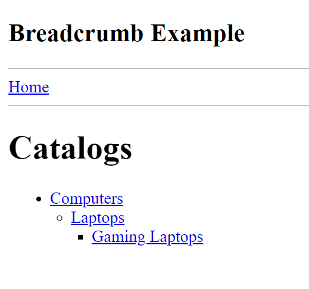
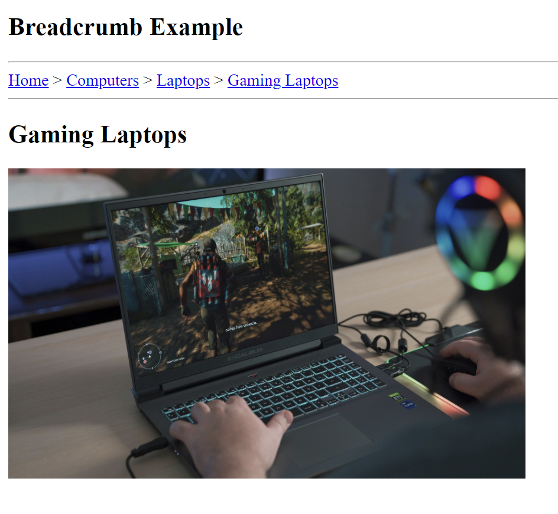

# Breadcrumb Navigation Example

This repository demonstrates a simple Angular application featuring a breadcrumb navigation component. The application showcases a hierarchical menu structure for navigating through various catalog items, such as Computers, Laptops, and Gaming Laptops.

## Key Features

- **Dynamic Breadcrumbs**: Automatically updates based on the current route, providing users with a clear path of navigation.
- **Nested Menu Structure**: Displays menu items in a visually organized manner using nested lists.
- **Angular Router Integration**: Utilizes Angular's Router for seamless navigation and route management.

## Installation

To get started with this example, follow these steps:

1. Clone the repository:
   ```bash
   git clone https://github.com/NashTech-Labs/breadcrumbExample.git
   ```

2. Navigate to the project directory:
   ```bash
   cd breadcrumbExample
   ```

3. Install the necessary dependencies:
   ```bash
   npm install
   ```

4. Serve the application:
   ```bash
   ng serve
   ```

5. Open your browser and navigate to `http://localhost:4200/`.

### Sample output
1. ### Home Screen Example: 
   
2. ### Other Example: 
   